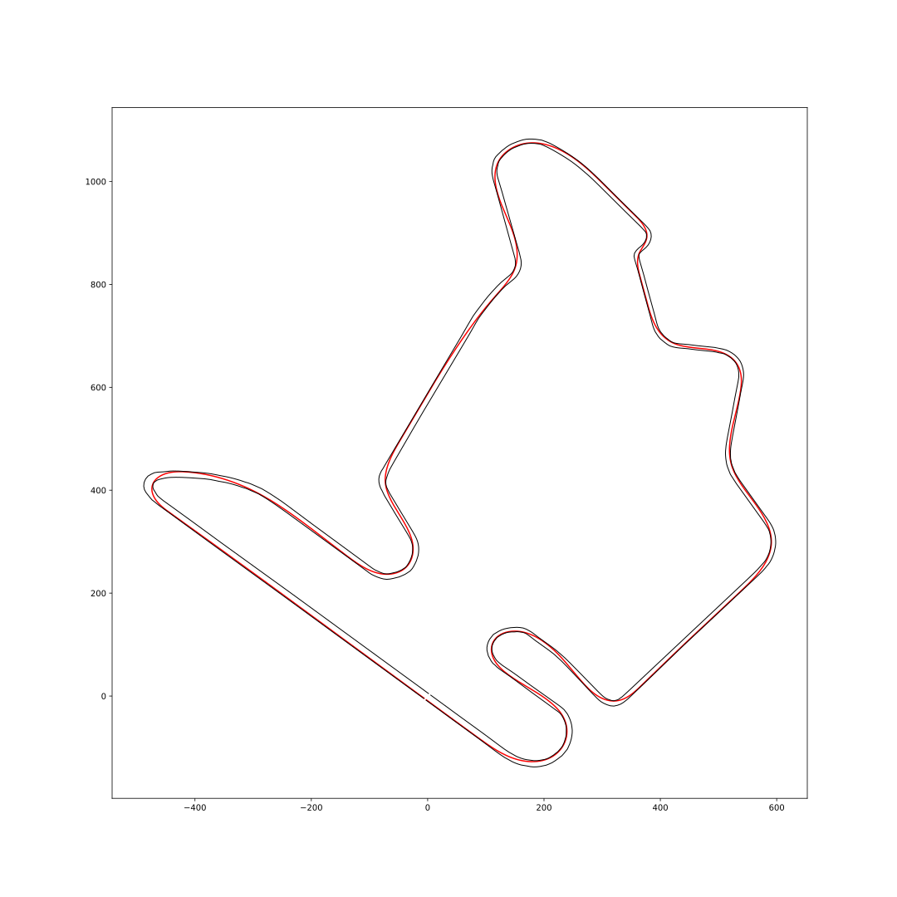
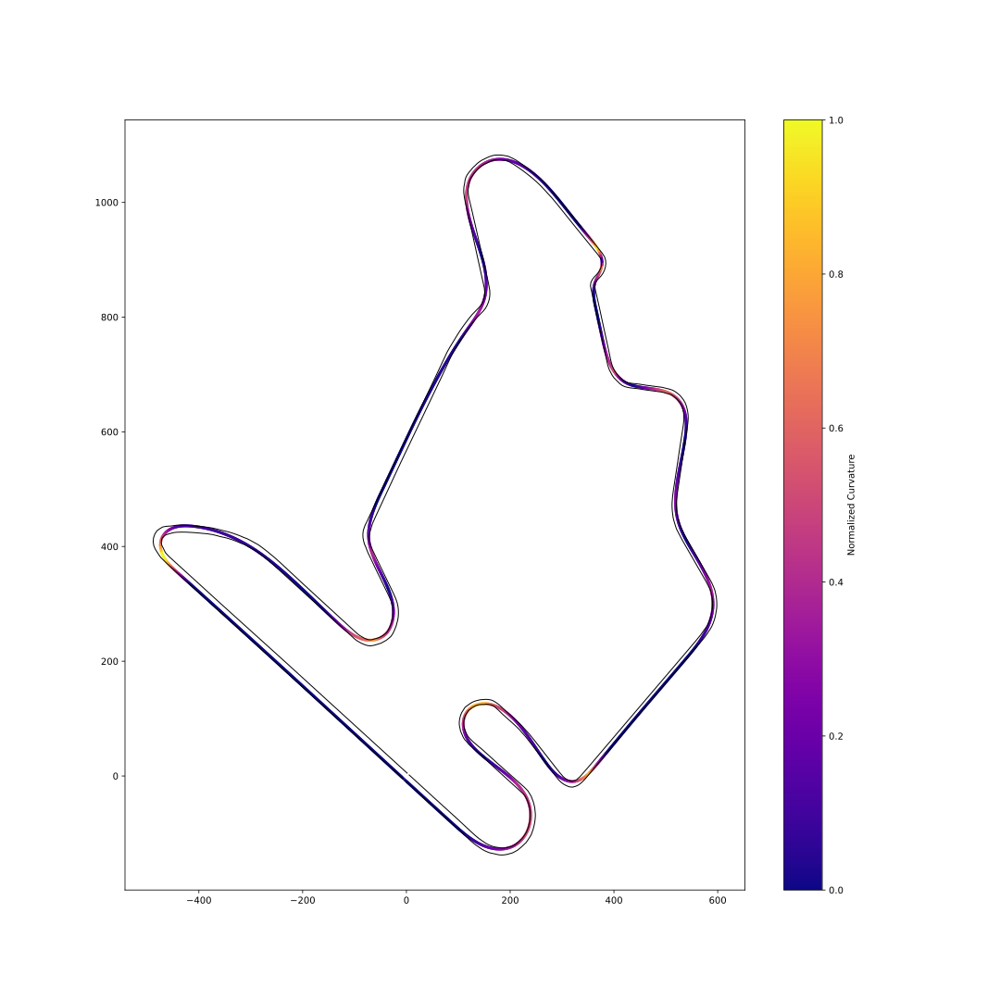

Taking track information gathered from GPS data in a project of TUMFTM to calculate and simulate forces acting on the vehicle.
Source of the data: https://github.com/TUMFTM/racetrack-database

We use the width of the track given in the data points in the racetrack database to recreate the left and right track limit lines.

Then we use the formula for the curvature of a curve at a particular point based on the radius of the circle that best approximates the curve at that point. The formula is used to calculate the curvature of the track at each point. The curvature could be then used to calculate the lateral forces acting on the vehicle.

To determine the speed of the vehicle we will also experiment with using the curvature. By offsetting the curvature by a certain amount we can get a rough estimate of where the vehicle should be braking and accelerating.

